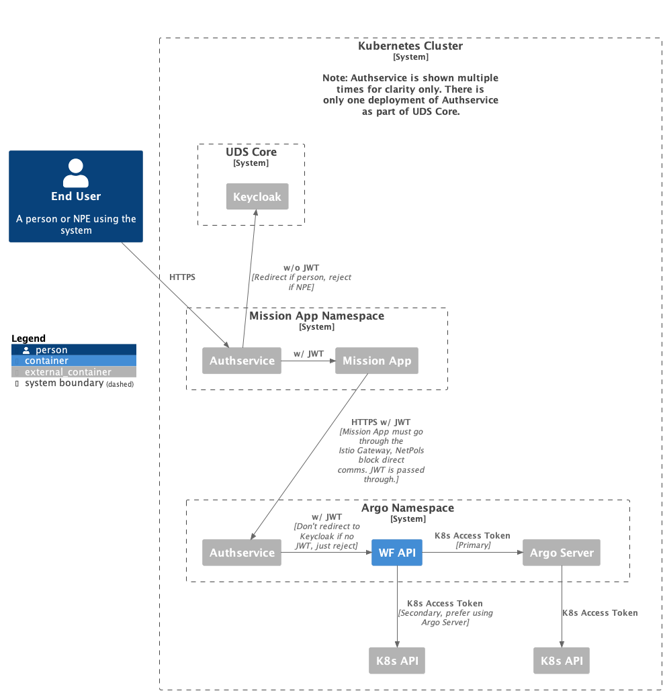

# WFAPI

REST API for interacting with Argo Workflows

## Purpose

This project is a REST API for interacting with Argo Workflows. You'll want to use this if:

- You manage a Kubernetes cluster that runs mission apps that need the ability to initiate and monitor workflow jobs
- You run Argo Workflows to provide that functionality
- But for security reasons you don't want to give those mission apps direct access to the Kubernetes API
- And you want more fine-grained control than what the Argo Workflows Server API would provide

### Why not use the Argo Workflows Server API? Why build this instead?

- The Argo Server API utilizes Kubernetes Access Tokens for authentication.
- For each mission app, you'd have to set up a Role, ServiceAccount, and RoleBinding in your cluster.
- Kubernetes RBAC is error-prone and difficult to manage.
- RBAC in our clusters is managed centrally by SSO (Keycloak).
- Allows us to extend the API with custom functionality that the Argo Server API doesn't provide.
- Mission app developers only need a small subset of the functionality that Argo Server API would provide. This API is simpler and easier to use.

### But Argo Workflows Server API supports OIDC! Why not use that?

- We didn't catch that it supports SSO initially, but after looking at it, we still prefer this approach.
- We have already explored how to integrate with UDS Core's Keycloak/Authservice from a REST API and are confident that there aren't any unknown gotchas.
- If we handle auth using this API we can keep Argo Workflows Server API in "dumb mode" and not have to deal with integrating it with Keycloak/Authservice.
- If we want to expose the workflow orchestration functionality to other clusters or the internet, we can do so without exposing Argo Server, which would be a much larger thing to have to STIG/vet/approve.



## Prerequisites

- Linux or MacOS x86_64
- Container runtime (we test using Docker, but others like Podman should work too)
- K3d
- UDS CLI
- yq

Windows is not supported at this time. We recommend using WSL2. Please let us know if you run into any issues when using WSL2.

ARM64 is not supported at this time, but only because we don't know of anyone wanting to use it. Please let us know if ARM64 support is important to you.

## Installation

WFAPI is published as a [Docker image](https://github.com/defenseunicorns-partnerships/wfapi/pkgs/container/wfapi%2Fcontainers%2Fwfapi) as well as a [Zarf Package](https://github.com/defenseunicorns-partnerships/wfapi/pkgs/container/wfapi%2Fpackages%2Fwfapi) published as an OCI artifact. We recommend using the Zarf Package. See the [Zarf Docs](https://docs.zarf.dev/getting-started/) for details on how to deploy a Zarf Package. Use [Zarf config variables](https://docs.zarf.dev/ref/config-files/) for configuration. See [zarf.yaml](zarf/zarf.yaml) for all available configuration options.

## Usage

WFAPI uses Swagger for API documentation. The best way to see the Swagger UI or get the `swagger.json` right now is to run WFAPI locally and navigate to [https://wfapi.uds.dev/swagger](https://wfapi.uds.dev/swagger). We intend to make it much easier to access the Swagger UI in the future.

The easiest way to spin up WFAPI locally is to use the testing UDS Task. This will spin up Argo Workflows and WFAPI in a local Kubernetes cluster powered by K3d. You need Docker, K3d, and UDS CLI installed. This is also the recommended approach for local development of applications that intend to interact with WFAPI.

```shell
uds run ci:up
```

If everything worked successfully, WFAPI will be available at [https://wfapi.uds.dev](https://wfapi.uds.dev).

## Authentication/Authorization

If variable ASPNETCORE_ENVIRONMENT is set to "Development", the API will not require authn/authz. This is useful for local development.

If variable ASPNETCORE_ENVIRONMENT is set to anything other than "Development" (like "Production", which is the default) the API requires a JWT token in the Authorization header. The token must be signed by the auth server specified in the configuration (likely Keycloak).

## FAQ

### What are the main features of this project?

- Trigger a workflow run from an existing template. Just provide the template name and any parameters.
- Get the status of one or more workflow runs.
- TBD

### Will I be able to create arbitrary workflows with this API?

Likely not. The plan for now is to only allow workflow runs that utilize an existing Workflow Template.

### What languages and frameworks are used in this project?

C# .NET Core Web API

### Why did you choose .NET Core Web API?

See the [ADR](docs/decisions/0002-programming-language-and-framework.md) for more information.

### Will you ever support other workflow orchestrators?

Maybe. If you have a use case for this, please let us know.

### Who maintains this thing?

Defense Unicorns -> Delivery -> Navy Domain -> Task Force Narwhal -> DUDES

### I want to use this for some other project. Can I?

Yes, with a caveat that your use-case may not be a priority for the maintainers since their focus is on solving specific customer-based goals rather than building a general-use product. But feel free to submit issues or PRs and/or fork and modify as needed.
